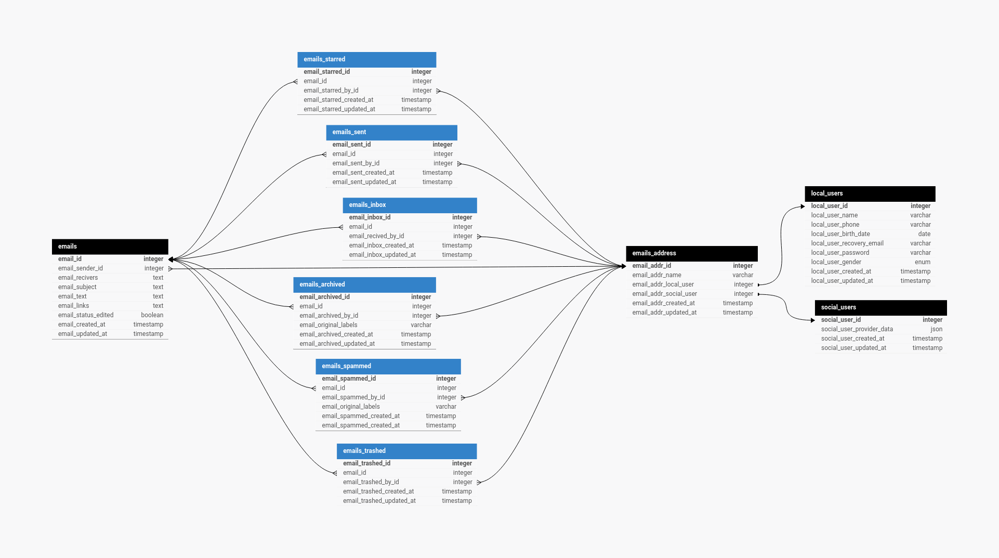

# Backend For an Email App

## Technologies Used To Build Backend:
-   Node.js
-   Typescript
-   Express.js
-   PostgreSQL
-   Socket.io
-   Passport.js
  
## Database Design Pattern


Database has 10 tables with all types of relations.
-   local_users
-   social_users
-   emails_address
-   emails
-   emails_inbox
-   emails_sent
-   emails_starred
-   emails_archived
-   emails_spammed
-   emails_trashed
## Authentication
Authetication was build using passport.js

Backend provides 2 types of authetication.
-   local authentication
-   social media authetication

Strategies.
-   local strategy (local authentication)
-   google strategy (social media authetication)
-   facebook strategy (social media authetication)
-   github strategy (social media authetication)


## Security, Authorization, Validation and Midllewares
Helmet was integrated in express midllewares to prevent XSS attacks.
Every api endpoint has an verify_auth midlleware.
Validation was built using express-validator and costume interafces that represents Data Transfer Objects (DTOs) for request body.
Requests objects an annotated.

## APIs EndPoints

### Authentication Endpoints
```javascript
POST    /api/v1/auth/signin
POST    /api/v1/auth/signup
POST    /api/v1/auth/signout

GET     /api/v1/auth/google
GET     /api/v1/auth/google/callback

GET     /api/v1/auth/facebook
GET     /api/v1/auth/facebook/callback

GET     /api/v1/auth/github
GET     /api/v1/auth/github/callback
```

### User Endpoint
```javascript
GET     /api/v1/user/available?name=[query:user_name]
```

### Account Endpoint
```javascript
DELETE  /api/v1/account/delete
```

### Email CRUD Operations Endpoints
```javascript
GET     /api/v1/email/inbox
GET     /api/v1/email/inbox/:email_id

GET     /api/v1/email/sent
GET     /api/v1/email/sent/:email_id

GET     /api/v1/email/starred
GET     /api/v1/email/starred/:email_id
PUT     /api/v1/email/star/:email_id
PUT     /api/v1/email/unstar/:email_id

GET     /api/v1/email/archived
GET     /api/v1/email/archived/:email_id
PUT     /api/v1/email/archive/:email_id
PUT     /api/v1/email/unarchived/:email_id

GET     /api/v1/email/spammed
GET     /api/v1/email/spammed/:email_id
PUT     /api/v1/email/spam/:email_id
PUT     /api/v1/email/unspam/:email_id

GET     /api/v1/email/trash
GET     /api/v1/email/trash/:email_id
PUT     /api/v1/email/trash/:email_id
DELETE  /api/v1/email/trash/:email_id
DELETE  /api/v1/email/trash/cleanup

GET     /api/v1/email/all
GET     /api/v1/email/all/:email_id

POST    /api/v1/email/send
PUT     /api/v1/email/update/:email_id
DELETE  /api/v1/email/destroy/:email_id
```